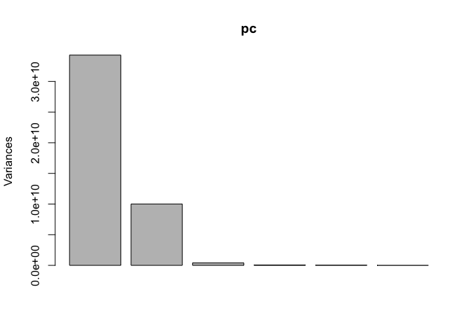
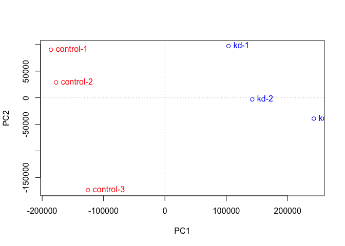
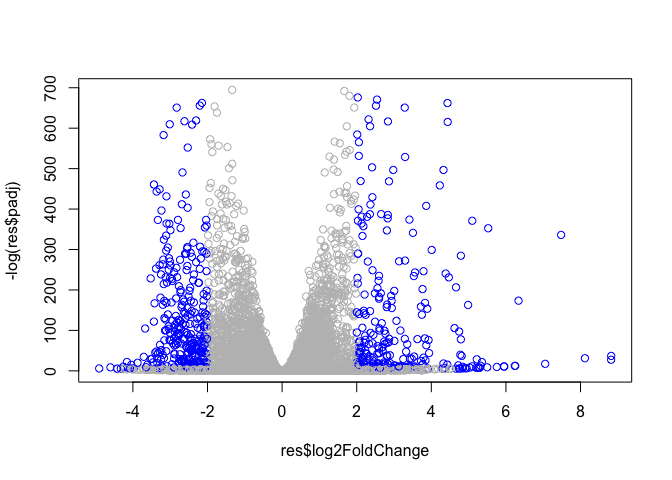

Class 15: Pathway Analysis from RNA-Seq Results
================

## About our Input Data

The data for today’s hands-on session comes from GEO entry: GSE37704,
which is associated with the following publication:

> Trapnell C, Hendrickson DG, Sauvageau M, Goff L et al. “Differential
> analysis of gene regulation at transcript resolution with RNA-seq”.
> Nat Biotechnol 2013 Jan;31(1):46-53. PMID: 23222703

## Import count and metadata

Read our input files:

``` r
metaFile <- "GSE37704_metadata.csv"
countFile <- "GSE37704_featurecounts.csv"

# Import metadata and take a peak
colData = read.csv(metaFile, row.names=1)
head(colData)
```

    ##               condition
    ## SRR493366 control_sirna
    ## SRR493367 control_sirna
    ## SRR493368 control_sirna
    ## SRR493369      hoxa1_kd
    ## SRR493370      hoxa1_kd
    ## SRR493371      hoxa1_kd

``` r
# Import countdata
countData = read.csv(countFile, row.names=1)
head(countData)
```

    ##                 length SRR493366 SRR493367 SRR493368 SRR493369 SRR493370
    ## ENSG00000186092    918         0         0         0         0         0
    ## ENSG00000279928    718         0         0         0         0         0
    ## ENSG00000279457   1982        23        28        29        29        28
    ## ENSG00000278566    939         0         0         0         0         0
    ## ENSG00000273547    939         0         0         0         0         0
    ## ENSG00000187634   3214       124       123       205       207       212
    ##                 SRR493371
    ## ENSG00000186092         0
    ## ENSG00000279928         0
    ## ENSG00000279457        46
    ## ENSG00000278566         0
    ## ENSG00000273547         0
    ## ENSG00000187634       258

The *length* column in countData is going to cause problems with the
required matching to the metadata file so lets remove it here

``` r
# Note we need to remove the first $length col from contData
countData <- as.matrix(countData[,-1])
head(countData)
```

    ##                 SRR493366 SRR493367 SRR493368 SRR493369 SRR493370
    ## ENSG00000186092         0         0         0         0         0
    ## ENSG00000279928         0         0         0         0         0
    ## ENSG00000279457        23        28        29        29        28
    ## ENSG00000278566         0         0         0         0         0
    ## ENSG00000273547         0         0         0         0         0
    ## ENSG00000187634       124       123       205       207       212
    ##                 SRR493371
    ## ENSG00000186092         0
    ## ENSG00000279928         0
    ## ENSG00000279457        46
    ## ENSG00000278566         0
    ## ENSG00000273547         0
    ## ENSG00000187634       258

### Check for match of contData and colData entries

Double check that the colnames in countData match the rowname id values
in the colData metadata
    file.

``` r
colnames(countData)
```

    ## [1] "SRR493366" "SRR493367" "SRR493368" "SRR493369" "SRR493370" "SRR493371"

``` r
rownames(colData)
```

    ## [1] "SRR493366" "SRR493367" "SRR493368" "SRR493369" "SRR493370" "SRR493371"

We can use the `all()` function to check if all entries in a vector are
TRUE.

``` r
all( colnames(countData) == rownames(colData) )
```

    ## [1] TRUE

``` r
# test how the all() function works
all( c(T,F,T) )
```

    ## [1] FALSE

## Remove zero count genes

We want to remove genes that have 0 count values in all experiments
(i.e. genes/rows that have 0 counts across all experiments/cols).

``` r
# Filter out zero count genes
countData = countData[ rowSums(countData) != 0, ]
head(countData)
```

    ##                 SRR493366 SRR493367 SRR493368 SRR493369 SRR493370
    ## ENSG00000279457        23        28        29        29        28
    ## ENSG00000187634       124       123       205       207       212
    ## ENSG00000188976      1637      1831      2383      1226      1326
    ## ENSG00000187961       120       153       180       236       255
    ## ENSG00000187583        24        48        65        44        48
    ## ENSG00000187642         4         9        16        14        16
    ##                 SRR493371
    ## ENSG00000279457        46
    ## ENSG00000187634       258
    ## ENSG00000188976      1504
    ## ENSG00000187961       357
    ## ENSG00000187583        64
    ## ENSG00000187642        16

We have 15975 genes remaining for analysis

``` r
nrow(countData)
```

    ## [1] 15975

## Principal Component Analysis (PCA)

A first step in any analysis like this is to plot and examine the data.
This is a rather large data set so conventional plots are going to be
challenging to make and interpret. Enter our old friend **PCA**.

``` r
# Rember to take the transpose of our data
pc <- prcomp(t(countData))
plot(pc)
```

<!-- -->

``` r
options(scipen=999) # turn off scientic notation
 summary(pc) 
```

    ## Importance of components:
    ##                                PC1         PC2         PC3        PC4
    ## Standard deviation     185191.3889 100053.0706 19982.55598 6886.30302
    ## Proportion of Variance      0.7659      0.2235     0.00892    0.00106
    ## Cumulative Proportion       0.7659      0.9894     0.99835    0.99941
    ##                               PC5             PC6
    ## Standard deviation     5149.55513 0.0000000009558
    ## Proportion of Variance    0.00059 0.0000000000000
    ## Cumulative Proportion     1.00000 1.0000000000000

``` r
plot(pc$x[,1:2], col=c(rep("red",3), rep("blue",3)) )
# add some labels
labs <- sub("_sirna","",colData$condition)
labs <- sub("hoxa1_","",labs)
labs <- paste0(labs, "-", 1:3)
text(pc$x[,1:2], labels = labs, col=c(rep("red",3), rep("blue",3)), pos=4)
abline(v=0, col="gray", lty=3)
abline(h=0, col="gray", lty=3)
```

<!-- -->

How about the loadings along the dominant PC1

``` r
plot( abs(pc$rotation[,"PC1"]), typ="h")
```

<!-- -->

``` r
# In the R console
# plot( abs(pc$rotation[,"PC1"]), typ="h")
# i <- identify( abs(pc$rotation[,"PC1"]), labels=rownames(countData) )
```

# DESeq analysis

Differential expression analysis with **DESeq2**

``` r
library(DESeq2)
```

    ## Loading required package: S4Vectors

    ## Loading required package: stats4

    ## Loading required package: BiocGenerics

    ## Loading required package: parallel

    ## 
    ## Attaching package: 'BiocGenerics'

    ## The following objects are masked from 'package:parallel':
    ## 
    ##     clusterApply, clusterApplyLB, clusterCall, clusterEvalQ,
    ##     clusterExport, clusterMap, parApply, parCapply, parLapply,
    ##     parLapplyLB, parRapply, parSapply, parSapplyLB

    ## The following objects are masked from 'package:stats':
    ## 
    ##     IQR, mad, sd, var, xtabs

    ## The following objects are masked from 'package:base':
    ## 
    ##     anyDuplicated, append, as.data.frame, basename, cbind,
    ##     colnames, dirname, do.call, duplicated, eval, evalq, Filter,
    ##     Find, get, grep, grepl, intersect, is.unsorted, lapply, Map,
    ##     mapply, match, mget, order, paste, pmax, pmax.int, pmin,
    ##     pmin.int, Position, rank, rbind, Reduce, rownames, sapply,
    ##     setdiff, sort, table, tapply, union, unique, unsplit, which,
    ##     which.max, which.min

    ## 
    ## Attaching package: 'S4Vectors'

    ## The following object is masked from 'package:base':
    ## 
    ##     expand.grid

    ## Loading required package: IRanges

    ## Loading required package: GenomicRanges

    ## Loading required package: GenomeInfoDb

    ## Loading required package: SummarizedExperiment

    ## Loading required package: Biobase

    ## Welcome to Bioconductor
    ## 
    ##     Vignettes contain introductory material; view with
    ##     'browseVignettes()'. To cite Bioconductor, see
    ##     'citation("Biobase")', and for packages 'citation("pkgname")'.

    ## Loading required package: DelayedArray

    ## Loading required package: matrixStats

    ## 
    ## Attaching package: 'matrixStats'

    ## The following objects are masked from 'package:Biobase':
    ## 
    ##     anyMissing, rowMedians

    ## Loading required package: BiocParallel

    ## 
    ## Attaching package: 'DelayedArray'

    ## The following objects are masked from 'package:matrixStats':
    ## 
    ##     colMaxs, colMins, colRanges, rowMaxs, rowMins, rowRanges

    ## The following objects are masked from 'package:base':
    ## 
    ##     aperm, apply, rowsum

``` r
# Setup the object with our data in the way DESeq wants it
dds = DESeqDataSetFromMatrix(countData=countData,
                             colData=colData,
                             design=~condition)
# Run the analysis
dds = DESeq(dds)
```

    ## estimating size factors

    ## estimating dispersions

    ## gene-wise dispersion estimates

    ## mean-dispersion relationship

    ## final dispersion estimates

    ## fitting model and testing

Get our results

``` r
res = results(dds)
res
```

    ## log2 fold change (MLE): condition hoxa1 kd vs control sirna 
    ## Wald test p-value: condition hoxa1 kd vs control sirna 
    ## DataFrame with 15975 rows and 6 columns
    ##                         baseMean     log2FoldChange              lfcSE
    ##                        <numeric>          <numeric>          <numeric>
    ## ENSG00000279457 29.9135794276176  0.179257083672691  0.324821565250144
    ## ENSG00000187634 183.229649921658  0.426457118403307  0.140265820376891
    ## ENSG00000188976 1651.18807619944 -0.692720464846367 0.0548465415913881
    ## ENSG00000187961 209.637938486147  0.729755610585227  0.131859899969346
    ## ENSG00000187583 47.2551232589398 0.0405765278756319  0.271892808601774
    ## ...                          ...                ...                ...
    ## ENSG00000273748 35.3026523877463  0.674387102558604  0.303666187454138
    ## ENSG00000278817 2.42302393023632 -0.388988266500022   1.13039377720312
    ## ENSG00000278384 1.10179649846993  0.332990658240633    1.6602614216556
    ## ENSG00000276345 73.6449563127136 -0.356180759105171  0.207715658398249
    ## ENSG00000271254 181.595902546813 -0.609666545167282   0.14132048280351
    ##                               stat
    ##                          <numeric>
    ## ENSG00000279457  0.551863246932653
    ## ENSG00000187634   3.04034951107424
    ## ENSG00000188976  -12.6301576133496
    ## ENSG00000187961   5.53432552849561
    ## ENSG00000187583   0.14923722361139
    ## ...                            ...
    ## ENSG00000273748   2.22081723425482
    ## ENSG00000278817 -0.344117487502873
    ## ENSG00000278384  0.200565196478864
    ## ENSG00000276345  -1.71475160732598
    ## ENSG00000271254  -4.31407063627822
    ##                                                               pvalue
    ##                                                            <numeric>
    ## ENSG00000279457                                    0.581042050747029
    ## ENSG00000187634                                  0.00236303749730971
    ## ENSG00000188976 0.00000000000000000000000000000000000143989540153787
    ## ENSG00000187961                             0.0000000312428248077716
    ## ENSG00000187583                                    0.881366448669145
    ## ...                                                              ...
    ## ENSG00000273748                                   0.0263633428047818
    ## ENSG00000278817                                    0.730757932009184
    ## ENSG00000278384                                    0.841038574220432
    ## ENSG00000276345                                   0.0863907773559442
    ## ENSG00000271254                                0.0000160275699407023
    ##                                                                padj
    ##                                                           <numeric>
    ## ENSG00000279457                                   0.686554777832896
    ## ENSG00000187634                                 0.00515718149494307
    ## ENSG00000188976 0.0000000000000000000000000000000000176548905389893
    ## ENSG00000187961                              0.00000011341299310762
    ## ENSG00000187583                                   0.919030615571379
    ## ...                                                             ...
    ## ENSG00000273748                                  0.0479091179108353
    ## ENSG00000278817                                   0.809772069001613
    ## ENSG00000278384                                   0.892653531513564
    ## ENSG00000276345                                   0.139761501281219
    ## ENSG00000271254                               0.0000453647639304918

``` r
plot(res$log2FoldChange, -log(res$padj))
```

<!-- -->

Lets add some color

``` r
mycols <- rep("gray",length(res$padj))
mycols[ abs(res$log2FoldChange) > 2] <- "blue"
mycols[ res$padj > 0.005] <- "gray"
plot(res$log2FoldChange, -log(res$padj), col=mycols)
```

<!-- -->

## Add gene symbols and entrez ids

``` r
BiocManager::install("AnnotationDbi")
BiocManager::install("org.Hs.eg.db")
```

``` r
library("AnnotationDbi")
library("org.Hs.eg.db")
```

    ## 

``` r
# We can translate between all the following database ID systems
columns(org.Hs.eg.db)
```

    ##  [1] "ACCNUM"       "ALIAS"        "ENSEMBL"      "ENSEMBLPROT" 
    ##  [5] "ENSEMBLTRANS" "ENTREZID"     "ENZYME"       "EVIDENCE"    
    ##  [9] "EVIDENCEALL"  "GENENAME"     "GO"           "GOALL"       
    ## [13] "IPI"          "MAP"          "OMIM"         "ONTOLOGY"    
    ## [17] "ONTOLOGYALL"  "PATH"         "PFAM"         "PMID"        
    ## [21] "PROSITE"      "REFSEQ"       "SYMBOL"       "UCSCKG"      
    ## [25] "UNIGENE"      "UNIPROT"

``` r
res$symbol = mapIds(org.Hs.eg.db,
                    keys=row.names(countData), # where are my IDs
                    keytype="ENSEMBL",         # what format are my IDs
                    column="SYMBOL",           # the new format I want
                    multiVals="first")
```

    ## 'select()' returned 1:many mapping between keys and columns

``` r
res
```

    ## log2 fold change (MLE): condition hoxa1 kd vs control sirna 
    ## Wald test p-value: condition hoxa1 kd vs control sirna 
    ## DataFrame with 15975 rows and 7 columns
    ##                         baseMean     log2FoldChange              lfcSE
    ##                        <numeric>          <numeric>          <numeric>
    ## ENSG00000279457 29.9135794276176  0.179257083672691  0.324821565250144
    ## ENSG00000187634 183.229649921658  0.426457118403307  0.140265820376891
    ## ENSG00000188976 1651.18807619944 -0.692720464846367 0.0548465415913881
    ## ENSG00000187961 209.637938486147  0.729755610585227  0.131859899969346
    ## ENSG00000187583 47.2551232589398 0.0405765278756319  0.271892808601774
    ## ...                          ...                ...                ...
    ## ENSG00000273748 35.3026523877463  0.674387102558604  0.303666187454138
    ## ENSG00000278817 2.42302393023632 -0.388988266500022   1.13039377720312
    ## ENSG00000278384 1.10179649846993  0.332990658240633    1.6602614216556
    ## ENSG00000276345 73.6449563127136 -0.356180759105171  0.207715658398249
    ## ENSG00000271254 181.595902546813 -0.609666545167282   0.14132048280351
    ##                               stat
    ##                          <numeric>
    ## ENSG00000279457  0.551863246932653
    ## ENSG00000187634   3.04034951107424
    ## ENSG00000188976  -12.6301576133496
    ## ENSG00000187961   5.53432552849561
    ## ENSG00000187583   0.14923722361139
    ## ...                            ...
    ## ENSG00000273748   2.22081723425482
    ## ENSG00000278817 -0.344117487502873
    ## ENSG00000278384  0.200565196478864
    ## ENSG00000276345  -1.71475160732598
    ## ENSG00000271254  -4.31407063627822
    ##                                                               pvalue
    ##                                                            <numeric>
    ## ENSG00000279457                                    0.581042050747029
    ## ENSG00000187634                                  0.00236303749730971
    ## ENSG00000188976 0.00000000000000000000000000000000000143989540153787
    ## ENSG00000187961                             0.0000000312428248077716
    ## ENSG00000187583                                    0.881366448669145
    ## ...                                                              ...
    ## ENSG00000273748                                   0.0263633428047818
    ## ENSG00000278817                                    0.730757932009184
    ## ENSG00000278384                                    0.841038574220432
    ## ENSG00000276345                                   0.0863907773559442
    ## ENSG00000271254                                0.0000160275699407023
    ##                                                                padj
    ##                                                           <numeric>
    ## ENSG00000279457                                   0.686554777832896
    ## ENSG00000187634                                 0.00515718149494307
    ## ENSG00000188976 0.0000000000000000000000000000000000176548905389893
    ## ENSG00000187961                              0.00000011341299310762
    ## ENSG00000187583                                   0.919030615571379
    ## ...                                                             ...
    ## ENSG00000273748                                  0.0479091179108353
    ## ENSG00000278817                                   0.809772069001613
    ## ENSG00000278384                                   0.892653531513564
    ## ENSG00000276345                                   0.139761501281219
    ## ENSG00000271254                               0.0000453647639304918
    ##                       symbol
    ##                  <character>
    ## ENSG00000279457           NA
    ## ENSG00000187634       SAMD11
    ## ENSG00000188976        NOC2L
    ## ENSG00000187961       KLHL17
    ## ENSG00000187583      PLEKHN1
    ## ...                      ...
    ## ENSG00000273748           NA
    ## ENSG00000278817 LOC102724770
    ## ENSG00000278384           NA
    ## ENSG00000276345 LOC107987373
    ## ENSG00000271254 LOC102724250

``` r
res$entrez = mapIds(org.Hs.eg.db,
                    keys=row.names(countData),
                    keytype="ENSEMBL",
                    column="ENTREZID",
                    multiVals="first")
```

    ## 'select()' returned 1:many mapping between keys and columns

## Pathway analysis

Here we are going to use the gage package for pathway analysis. Once we
have a list of enriched pathways, we’re going to use the pathview
package to draw pathway diagrams, shading the molecules in the pathway
by their degree of
    up/down-regulation.

``` r
library(pathview)
```

    ## ##############################################################################
    ## Pathview is an open source software package distributed under GNU General
    ## Public License version 3 (GPLv3). Details of GPLv3 is available at
    ## http://www.gnu.org/licenses/gpl-3.0.html. Particullary, users are required to
    ## formally cite the original Pathview paper (not just mention it) in publications
    ## or products. For details, do citation("pathview") within R.
    ## 
    ## The pathview downloads and uses KEGG data. Non-academic uses may require a KEGG
    ## license agreement (details at http://www.kegg.jp/kegg/legal.html).
    ## ##############################################################################

``` r
library(gage)
library(gageData)
```

``` r
data(kegg.sets.hs)
data(sigmet.idx.hs)

# Focus on signaling and metabolic pathways only
kegg.sets.hs = kegg.sets.hs[sigmet.idx.hs]

# Examine the first 3 pathways
head(kegg.sets.hs, 3)
```

    ## $`hsa00232 Caffeine metabolism`
    ## [1] "10"   "1544" "1548" "1549" "1553" "7498" "9"   
    ## 
    ## $`hsa00983 Drug metabolism - other enzymes`
    ##  [1] "10"     "1066"   "10720"  "10941"  "151531" "1548"   "1549"  
    ##  [8] "1551"   "1553"   "1576"   "1577"   "1806"   "1807"   "1890"  
    ## [15] "221223" "2990"   "3251"   "3614"   "3615"   "3704"   "51733" 
    ## [22] "54490"  "54575"  "54576"  "54577"  "54578"  "54579"  "54600" 
    ## [29] "54657"  "54658"  "54659"  "54963"  "574537" "64816"  "7083"  
    ## [36] "7084"   "7172"   "7363"   "7364"   "7365"   "7366"   "7367"  
    ## [43] "7371"   "7372"   "7378"   "7498"   "79799"  "83549"  "8824"  
    ## [50] "8833"   "9"      "978"   
    ## 
    ## $`hsa00230 Purine metabolism`
    ##   [1] "100"    "10201"  "10606"  "10621"  "10622"  "10623"  "107"   
    ##   [8] "10714"  "108"    "10846"  "109"    "111"    "11128"  "11164" 
    ##  [15] "112"    "113"    "114"    "115"    "122481" "122622" "124583"
    ##  [22] "132"    "158"    "159"    "1633"   "171568" "1716"   "196883"
    ##  [29] "203"    "204"    "205"    "221823" "2272"   "22978"  "23649" 
    ##  [36] "246721" "25885"  "2618"   "26289"  "270"    "271"    "27115" 
    ##  [43] "272"    "2766"   "2977"   "2982"   "2983"   "2984"   "2986"  
    ##  [50] "2987"   "29922"  "3000"   "30833"  "30834"  "318"    "3251"  
    ##  [57] "353"    "3614"   "3615"   "3704"   "377841" "471"    "4830"  
    ##  [64] "4831"   "4832"   "4833"   "4860"   "4881"   "4882"   "4907"  
    ##  [71] "50484"  "50940"  "51082"  "51251"  "51292"  "5136"   "5137"  
    ##  [78] "5138"   "5139"   "5140"   "5141"   "5142"   "5143"   "5144"  
    ##  [85] "5145"   "5146"   "5147"   "5148"   "5149"   "5150"   "5151"  
    ##  [92] "5152"   "5153"   "5158"   "5167"   "5169"   "51728"  "5198"  
    ##  [99] "5236"   "5313"   "5315"   "53343"  "54107"  "5422"   "5424"  
    ## [106] "5425"   "5426"   "5427"   "5430"   "5431"   "5432"   "5433"  
    ## [113] "5434"   "5435"   "5436"   "5437"   "5438"   "5439"   "5440"  
    ## [120] "5441"   "5471"   "548644" "55276"  "5557"   "5558"   "55703" 
    ## [127] "55811"  "55821"  "5631"   "5634"   "56655"  "56953"  "56985" 
    ## [134] "57804"  "58497"  "6240"   "6241"   "64425"  "646625" "654364"
    ## [141] "661"    "7498"   "8382"   "84172"  "84265"  "84284"  "84618" 
    ## [148] "8622"   "8654"   "87178"  "8833"   "9060"   "9061"   "93034" 
    ## [155] "953"    "9533"   "954"    "955"    "956"    "957"    "9583"  
    ## [162] "9615"

The main gage() function requires a named vector of fold changes, where
the names of the values are the Entrez gene IDs.

``` r
foldchanges = res$log2FoldChange
names(foldchanges) = res$entrez
head(foldchanges)
```

    ##        <NA>      148398       26155      339451       84069       84808 
    ##  0.17925708  0.42645712 -0.69272046  0.72975561  0.04057653  0.54281049

``` r
# Get the results
keggres = gage(foldchanges, gsets=kegg.sets.hs)
```

Now lets look at the object returned from gage().

``` r
attributes(keggres)
```

    ## $names
    ## [1] "greater" "less"    "stats"

``` r
# Look at the first few down (less) pathways
head(keggres$less)
```

    ##                                            p.geomean stat.mean
    ## hsa04110 Cell cycle                   0.000008995727 -4.378644
    ## hsa03030 DNA replication              0.000094240761 -3.951803
    ## hsa03013 RNA transport                0.001246881511 -3.059466
    ## hsa03440 Homologous recombination     0.003066756308 -2.852899
    ## hsa04114 Oocyte meiosis               0.003784519730 -2.698128
    ## hsa00010 Glycolysis / Gluconeogenesis 0.008961412782 -2.405398
    ##                                                p.val       q.val set.size
    ## hsa04110 Cell cycle                   0.000008995727 0.001448312      121
    ## hsa03030 DNA replication              0.000094240761 0.007586381       36
    ## hsa03013 RNA transport                0.001246881511 0.066915974      144
    ## hsa03440 Homologous recombination     0.003066756308 0.121861535       28
    ## hsa04114 Oocyte meiosis               0.003784519730 0.121861535      102
    ## hsa00010 Glycolysis / Gluconeogenesis 0.008961412782 0.212222694       53
    ##                                                 exp1
    ## hsa04110 Cell cycle                   0.000008995727
    ## hsa03030 DNA replication              0.000094240761
    ## hsa03013 RNA transport                0.001246881511
    ## hsa03440 Homologous recombination     0.003066756308
    ## hsa04114 Oocyte meiosis               0.003784519730
    ## hsa00010 Glycolysis / Gluconeogenesis 0.008961412782

``` r
pathview(gene.data=foldchanges, pathway.id="hsa04110")
```

    ## 'select()' returned 1:1 mapping between keys and columns

    ## Info: Working in directory /Users/DinaZ/Desktop/UCSD_Documents/CLASSES/BioInformatics/Projects/BioInformatics_DZ_github/Class15

    ## Info: Writing image file hsa04110.pathview.png


**ToDo**: Add more pathway figures here…

**ToDo**: Add GO analysis section…
