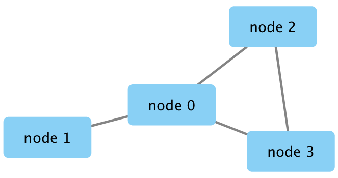

```{r setup, include=FALSE}
knitr::opts_chunk$set(echo = TRUE)
```
```{r}
### install a few packages
#BiocManager::install("RCy3")
#install.packages("igraph")

```

```{r}
g <- makeSimpleIgraph()
```


```{r}
createNetworkFromIgraph(g,"myGraph")
```
```{r}
fig <- exportImage(filename="demo", type="png", height=350)
fig
```

```{r}

```

```{r}
setVisualStyle("Marquee")

```

```{r}
styles <- getVisualStyleNames()
styles

```

```{r}
#setVisualStyle(styles[13])
#setVisualStyle(styles[18])

```
```{r}
plot(g)

```

